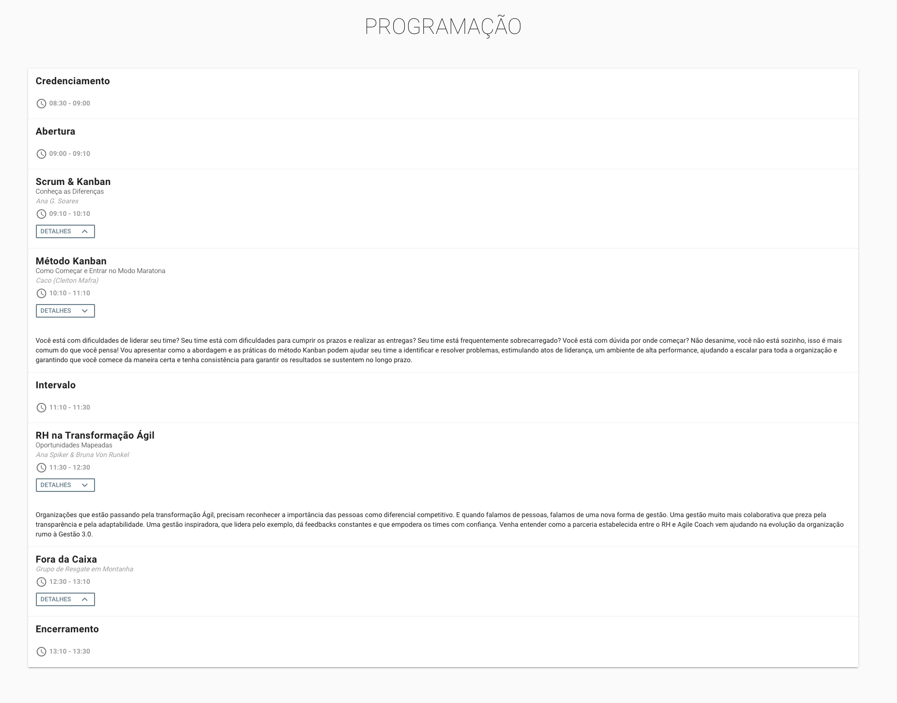

<h1 align="center">
    Agile Joinville Conference 2019
</h1>

<h3 align="center">
  Agile Joinville Conference 2019 Page
</h3>

<p align="center">
  

  

  <a href="https://www.linkedin.com/in/luanoliveira/" target="_blank">
    
  </a>

  <a href="https://github.com/luanelioliveira/agile-joinville-webapp/commits/master">
    
  </a>

  <a href="https://github.com/luanelioliveira/agile-joinville-webapp/issues">
    
  </a>

  
</p>
<p align="center">
  <a href="#rocket-Technologies">Technologies</a>&nbsp;&nbsp;&nbsp;|&nbsp;&nbsp;&nbsp;
  <a href="#-project">Project</a>&nbsp;&nbsp;&nbsp;|&nbsp;&nbsp;&nbsp;
  <a href="#-layout">Layout</a>&nbsp;&nbsp;&nbsp;|&nbsp;&nbsp;&nbsp;
  <a href="#-installation">Installation</a>&nbsp;&nbsp;&nbsp;|&nbsp;&nbsp;&nbsp;
  <a href="#-how-to-contribute">How to contribute</a>&nbsp;&nbsp;&nbsp;|&nbsp;&nbsp;&nbsp;
  <a href="#memo-license">License</a>
</p>

<br>

## :rocket: Technologies

This project was developed with the following technologies:

- [Vue.js](https://vuejs.org/)
- [Firebase](https://firebase.google.com/)
  - [Agile Conference Joinville 2019](https://github.com/luanelioliveira/agile-joinville-webapp)

## 💻 Project

<p>This is a project develop to community Agile Joinville.</p>

- [Check it out](https://agile.joinville.br/)

## 🔖 Layout

<table>
  <tbody>
	 <tr>
	   <td></td>
	   <td></td>
	   <td></td>
	 </tr>
	  <tr>
	   <td></td>
	   <td></td>
	   <td></td>
	 </tr>
  </tbody>
</table>

 
## :desktop_computer: Installation

- First you have to clone it: ```git clone https://github.com/luanelioliveira/agile-joinville-webapp.git```
- Install dependencies:  ```cd agile-joinville-webapp yarn install```
- Run application: ```yarn serve```
- Then open http://localhost:8080/ to see your app.

## 🤔 How to contribute
Pull requests are welcome. For major changes, please open an issue first to discuss what you would like to change.
Please make sure to update tests as appropriate.

- Make a fork;
- Create a branck with your feature: `git checkout -b my-feature`;
- Commit changes: `git commit -m 'feat: My new feature'`;
- Make a push to your branch: `git push origin my-feature`.

After merging your receipt request to done, you can delete a branch from yours.

## :memo: License

This project is under the MIT license. See the [LICENSE](LICENSE) for details.

---
Made by Luan Eli Oliveira :wave: [Get in touch!](https://www.linkedin.com/in/luanoliveira/)